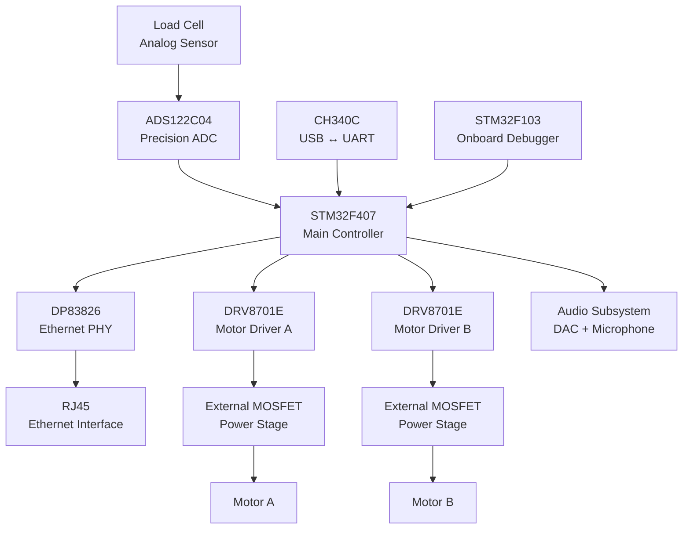

  

<h1 align="center">FusionCore MX</h1>

  <b>4-Layer STM32 Mixed-Signal Control Platform</b>

  Ethernet • Precision Acquisition • Motor Control • Audio • USB • Onboard Debugging

  
  
  
  

---

## Overview

FusionCore MX is a custom 4-layer mixed-signal embedded control platform built around the STM32F407.

The board brings together high-speed digital communication, precision analog acquisition, motor-control power electronics, audio circuitry, USB connectivity and onboard debugging on a single PCB.

The project was developed as a practical exploration of mixed-signal PCB design, with particular focus on:

- component placement
- return-current paths
- power distribution
- signal integrity
- analog/digital partitioning
- differential routing
- switching-current loops
- manufacturability

---

## System Architecture

FusionCore MX is organized around the STM32F407, which acts as the central processing and control unit.  
The board combines communication, precision sensing, motor control, audio and development interfaces on a single 4-layer PCB.

### Hardware Domains

| Domain | Main Components | Role |
|---|---|---|
| Processing | STM32F407 | Central control and signal processing |
| Ethernet | DP83826 + RJ45 | Wired network communication |
| Precision Sensing | ADS122C04 | High-resolution load-cell acquisition |
| Motor Control | 2× DRV8701E + external MOSFETs | Dual power motor-control stages |
| USB | CH340C | USB-to-UART communication |
| Debug | STM32F103 | Onboard programming and debugging |
| Audio | DAC + microphone interface | Audio input/output processing |

## Key Hardware

| Function | Implementation |
|---|---|
| Main MCU | STM32F407 |
| PCB | 4-Layer |
| Ethernet | DP83826 PHY + RJ45 |
| Precision ADC | ADS122C04 |
| Motor Control | 2× DRV8701E + external N-MOSFET stages |
| USB-UART | CH340C |
| Debug Interface | STM32F103 onboard debugger |
| Analog Acquisition | Load-cell interface |
| Audio | DAC + microphone interface |

---

> Full technical documentation, PCB renders, architecture diagrams and design files are being added.
