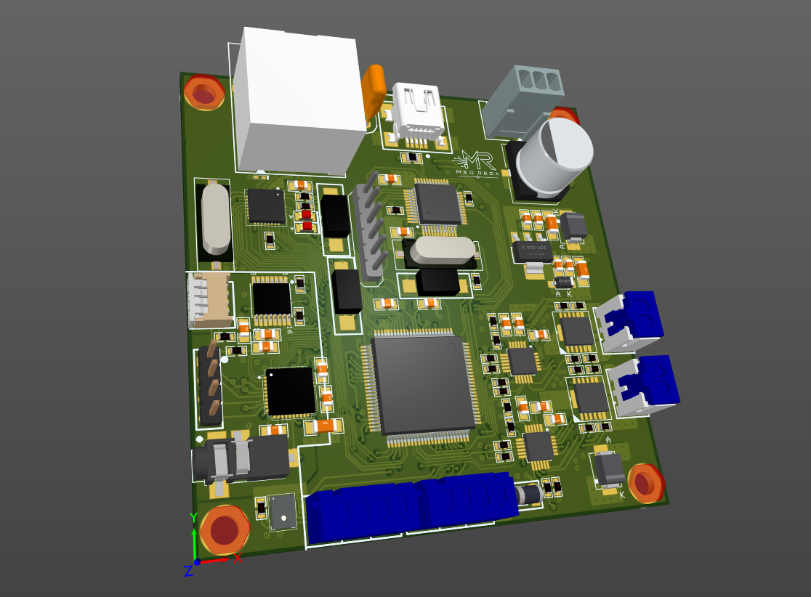
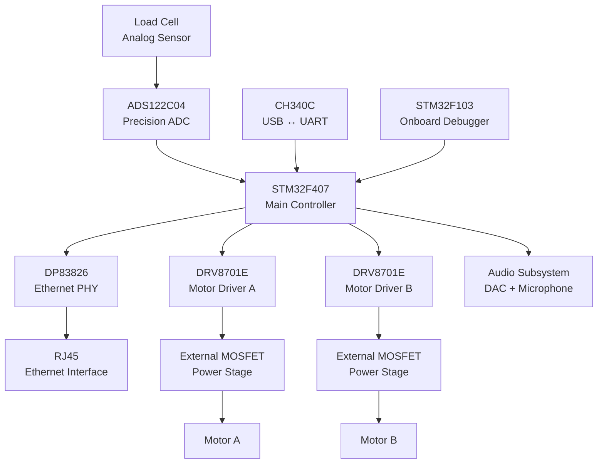
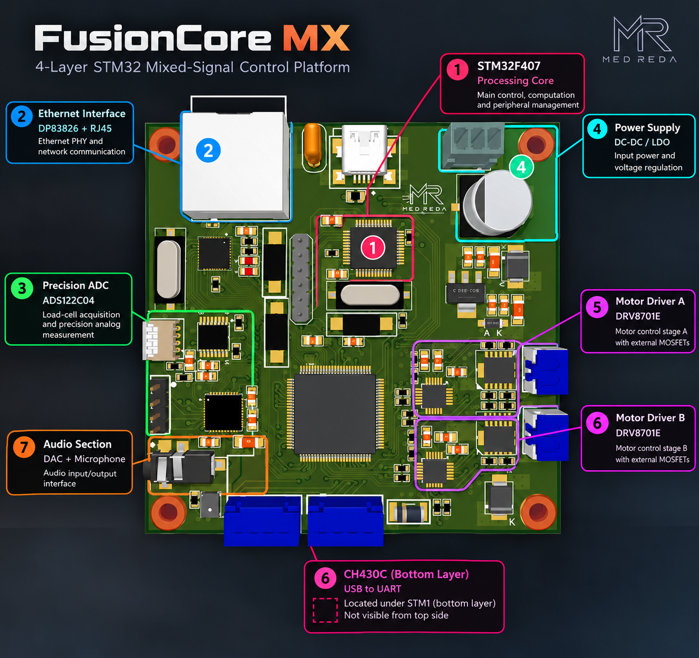
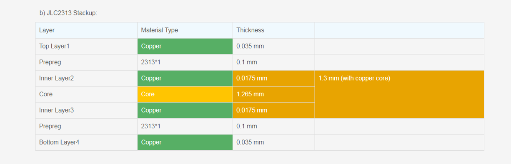

<p align="center">
  
</p>

<h1 align="center">FusionCore MX</h1>

<p align="center">
  <b>4-Layer STM32 Mixed-Signal Control Platform</b>
</p>

<p align="center">
  Ethernet • Precision Acquisition • Motor Control • Audio • USB • Onboard Debugging
</p>

<p align="center">
  
  
  
  
</p>

---

## Overview

FusionCore MX is a custom 4-layer mixed-signal embedded control platform built around the STM32F407.

The board brings together high-speed digital communication, precision analog acquisition, motor-control power electronics, audio circuitry, USB connectivity and onboard debugging on a single PCB.

The project was developed as a practical exploration of mixed-signal PCB design, with particular focus on:

- component placement
- return-current paths
- power distribution
- signal integrity
- analog/digital partitioning
- differential routing
- switching-current loops
- manufacturability

---

## System Architecture

FusionCore MX is organized around the STM32F407, which acts as the central processing and control unit.  
The board combines communication, precision sensing, motor control, audio and development interfaces on a single 4-layer PCB.


## Board Tour

The physical layout was organized into functional regions to keep related circuitry close together, reduce critical current-loop areas, and limit interaction between sensitive analog circuitry, high-speed interfaces and switching power stages.

<p align="center">
  
</p>

| # | Subsystem | Function |
|---:|---|---|
| **01** | STM32F407 Processing Core | Main control, computation and peripheral management |
| **02** | DP83826 Ethernet Interface | Ethernet PHY and connection to the RJ45 interface |
| **03** | ADS122C04 Analog Front End | Precision acquisition for load-cell measurements |
| **04** | Motor Driver A | DRV8701E and external MOSFET power stage |
| **05** | Motor Driver B | Second independent motor-control power stage |
| **06** | CH340C USB-UART | USB serial communication and development interface |
| **07** | STM32F103 Debugger | Integrated programming and debugging interface |
| **08** | Audio Subsystem | DAC and microphone signal interface |

### Placement Philosophy

The board was not partitioned only by schematic function. Placement was also driven by the electrical behavior of each subsystem.

- **Sensitive analog circuitry** was kept away from noisy switching regions.
- **Motor-driver power loops** were kept compact to minimize high-current loop area.
- **Ethernet circuitry** was grouped around the PHY and connector to reduce critical route lengths.
- **Decoupling networks** were positioned close to their respective IC supply pins.
- **The MCU** was positioned centrally to maintain practical routing access to the major peripherals.
- **Continuous return paths** were considered when routing digital and high-speed signals.

## PCB Stackup & Layer Strategy

FusionCore MX was implemented as a 4-layer PCB using the JLC2313 stackup.

<p align="center">
  
</p>

### Layer Assignment

| Layer | Primary Role | Copper |
|---|---|---:|
| **L1 — Top** | Components + critical signal routing | 35 µm |
| **L2 — Inner 1** | Continuous ground reference plane | 17.5 µm |
| **L3 — Inner 2** | Power distribution + secondary routing | 17.5 µm |
| **L4 — Bottom** | Signal routing + bottom-side components | 35 µm |

The resulting board thickness is approximately **1.57 mm**, corresponding to a standard ~1.6 mm PCB construction.
### Why a 4-Layer Stackup?

A 4-layer architecture was selected to provide a dedicated low-impedance
ground reference while keeping the outer layers available for component
placement and signal routing.

The layer arrangement was chosen to support:

- continuous return-current paths beneath high-speed signals,
- improved power-distribution integrity,
- reduced loop areas,
- lower coupling between noisy power stages and sensitive analog circuitry,
- cleaner routing of Ethernet and digital interfaces,
- easier separation of analog, digital and power domains.

### Physical Construction

```text
┌───────────────────────────────────────────────┐
│ L1 — TOP        Signals + Components   35 µm │
├───────────────────────────────────────────────┤
│                Prepreg 2313            100 µm│
├───────────────────────────────────────────────┤
│ L2 — INNER      GND Plane              17.5 µm│
├───────────────────────────────────────────────┤
│                    CORE               1.265 mm│
├───────────────────────────────────────────────┤
│ L3 — INNER      Power + Signals        17.5 µm│
├───────────────────────────────────────────────┤
│                Prepreg 2313            100 µm│
├───────────────────────────────────────────────┤
│ L4 — BOTTOM     Signals + Components    35 µm│
└───────────────────────────────────────────────┘

              Total ≈ 1.57 mm


## Hardware Domains

| Domain | Main Components | Role |
|---|---|---|
| Processing | STM32F407 | Central control and signal processing |
| Ethernet | DP83826 + RJ45 | Wired network communication |
| Precision Sensing | ADS122C04 | High-resolution load-cell acquisition |
| Motor Control | 2× DRV8701E + external MOSFETs | Dual power motor-control stages |
| USB | CH340C | USB-to-UART communication |
| Debug | STM32F103 | Onboard programming and debugging |
| Audio | DAC + microphone interface | Audio input/output processing |


---

> Full technical documentation, PCB renders, architecture diagrams and design files are being added.
